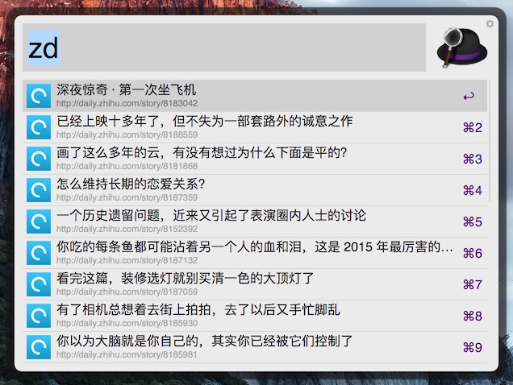

#知乎日报 Alfred Workflow

###1.安装

* bin 目录为 workflow 包，双击打开即可安装
* src 目录为源码

###2.使用

* 默认使用 `zd` (zhihu daily) 拉取最新内容列表
* 回车打开指定内容页面

###3.预览

###4.参考

* [alfred-workflow-for-python](https://github.com/deanishe/alfred-workflow)
* [alfred-workflow-tutorial](http://www.deanishe.net/alfred-workflow/index.html)
* [知乎日报-API-分析](https://github.com/izzyleung/ZhihuDailyPurify/wiki/%E7%9F%A5%E4%B9%8E%E6%97%A5%E6%8A%A5-API-%E5%88%86%E6%9E%90)